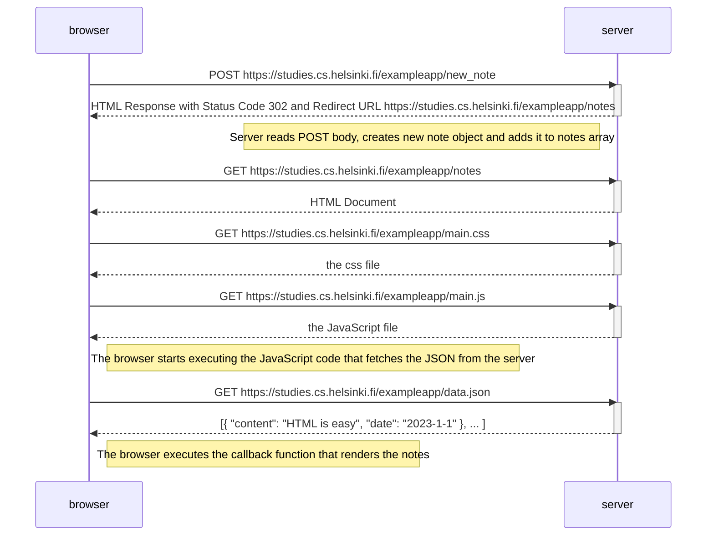
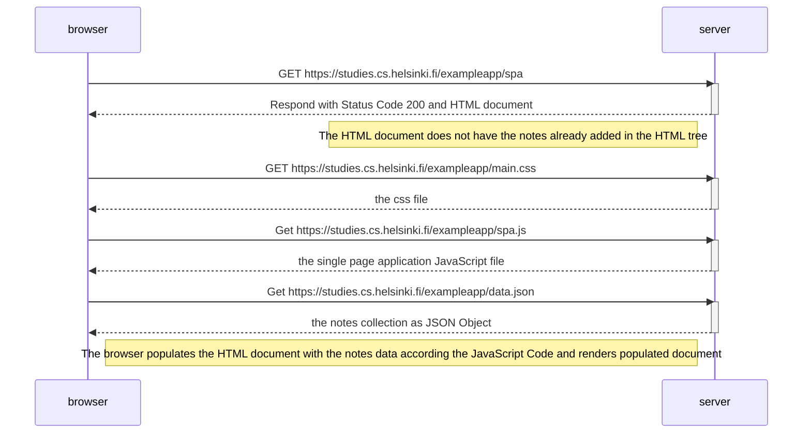
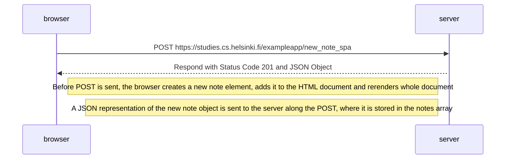

# Submissions to exercises part 0

This file contains the submitted solutions to exercises 0.4-0.6 of part 0, see [Exercises 0.1-0.6](https://fullstackopen.com/en/part0/fundamentals_of_web_apps#exercises-0-1-0-6).

## Exercise 0.4: New note diagram

## Exercise 0.5: Single page app diagram

## Exercise 0.6: New note in Single page app diagram

